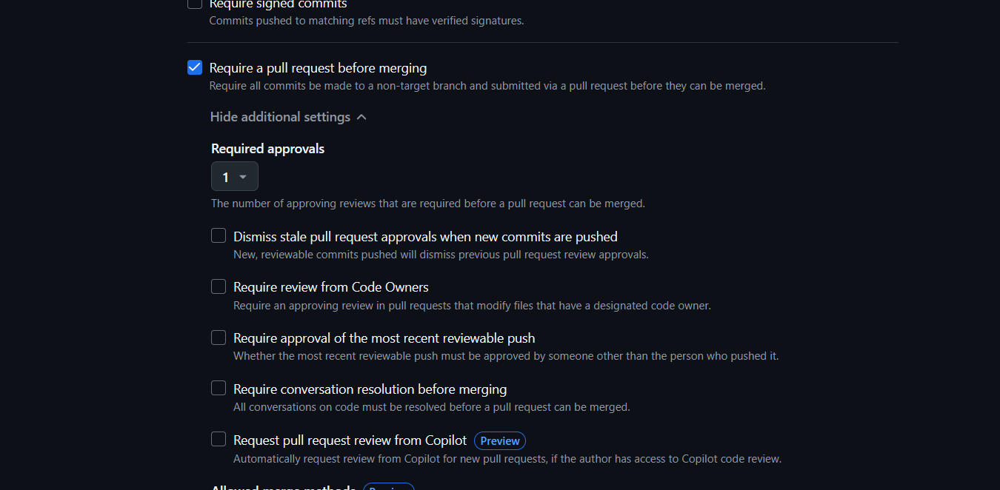

# 🚀 Git Basics

Git is a **distributed version control system** that helps developers track changes, collaborate, and manage different versions of a project efficiently.

---

## 🛠️ Installing Git

Before using Git, install it on your system:

### 📌 Windows
Download and install Git from [git-scm.com](https://git-scm.com/).

### 📌 macOS
```bash
$ brew install git
```

### 📌 Linux (Debian-based)

```bash

$ sudo apt update
$ sudo apt install git

```
### Verify the installation:

```bash
$ git --version
```

# 🔥 Common Git Commands

## ✅ Initialize a Git repository

```bash
$ git init
# Creates a new Git repository in the current directory.
```


## 🔄 Clone a repository

```bash
$ git clone https://github.com/mihir-hadavani-inventyv/Git-Training_Aman-Sir

# Copies an existing remote repository to your local machine.

```


## 📋 Check repository status

```bash
 $ git status
   
# Shows the state of your working directory, including modified and untracked files.
```

## 📂 Stage changes

```bash
$ git add .

# Adds all modified and new files to the staging area.
```

## 💾 Commit changes
```bash
$ git commit -m "Commit message"

# Saves the staged changes to the local repository with a meaningful message.
```

## 📤 Push changes to remote
```bash
$ git push origin <branch>

# Uploads your commits from the local branch to the remote repository.
```
## 📥 Pull changes from remote

```bash
$ git pull origin <branch>

#Fetches and merges the latest changes from the remote branch to your local branch.
```

## 🌿 Check branch list
```bash
$ git branch

# Lists all branches in your repository.
```


## 🔀 Switch branches

```bash
$ git checkout <branch>

# Switches to the specified branch.
```

## ➕ Create a new branch

```bash
$ git branch <branch_name>

#Creates a new branch without switching to it.
```

## 🔄 Create and switch to a new branch

```bash
$ git checkout -b <branch_name>

# Creates a new branch and switches to it immediately.
```

# 🌱 What is Branching?
Branching in Git allows developers to work on different features or fixes simultaneously without affecting the main codebase. Each branch is an independent version of the project.

Example:

- ```main``` → The stable production branch
- ``dev`` → The development branch
- ``feature`` → A branch for new features


---


# 🔗 Git Branching Workflow


## ✨ Create branches

```
$ git branch alpha
$ git branch dev
$ git branch feature
```

## 🔄 Switch to 'feature' branch

```
$ git checkout feature

```

## 💾 Commit changes in 'feature' branch

```
$ git commit -m "Feature update"
```

## 🔙 Switch to 'main' branch and commit

```
$ git checkout main
$ git commit -m "Main branch commit"
```
## 🚀 Create 'release' branch from 'main'
```
$ git checkout -b release main
$ git commit -m "Release branch commit"
```

## 🔀 Merge 'feature' into 'release'

```
$ git checkout release
$ git merge feature
```

## 🔙 Switch back to 'main' and commit

```
$ git checkout main
$ git commit -m "Finalizing main branch"
```

## 🔄 Merge 'release' into 'main'

```
$ git merge release
```
---

# 🔥 Ruleset
GitHub allows you to enforce rules on branches using branch protection rules. Here’s how to set up a ruleset:

### 📌 Steps to Add a Ruleset:
1. Go to Your Repository

   - Open GitHub and navigate to your repository.
2. Access Repository Settings

   - Click on ``Settings`` (top-right corner).
3. Navigate to Rulesets

   - Scroll down to Code and ``automation → Rulesets``.
4. Create a New Ruleset

   - Click New ``ruleset`` and give it a name.
5. Set the Rules

   - Select branches or tags where the rules will apply.
   - Enable required checks like:
      - ✅ Require pull request reviews before merging.
      - ✅ Restrict force pushes and deletions.
6. Save and Apply the Ruleset

   - Click Create or Update Ruleset to apply.

## 🔥 Benefits of Using a Ruleset:
   - 🛑 Prevents accidental merges to protected branches.
   - ✅ Ensures quality by requiring code reviews and status checks.

---





# 🔄 PR Creation and Merge
A Pull Request (PR) is used to propose changes from one branch to another and request code reviews before merging.

### 🔵 Steps to Create a Pull Request on GitHub
1. Push changes to remote Ensure your local branch is up-to-date and push it:

```bash
$ git push origin <branch_name>
```

2. Go to GitHub and open your repository
   - Navigate to the repository where your branch exists.

3. Create a Pull Request (PR)

   - Click on the ``Pull Requests`` tab.
   - Click New ``Pull Request``.
   
   - Select the ``base branch`` (where changes will be merged).
   - Select the ``compare branch`` (your feature branch).
   - Add a ``title and description`` for the PR. 
   - Click ``Create Pull Request``.


# ✅ Approve, Review, and Merge PR


4. Request a Review

   - ``Assign reviewers`` (team members).
   
   - Add labels or project links if needed.
5. Approve and Merge the Pull Request

   - Once ``approved, click Merge Pull Request``.
   
   - Choose ``Merge commit, Squash merge, or Rebase merge``.
   
   - Click ``Confirm merge``.


