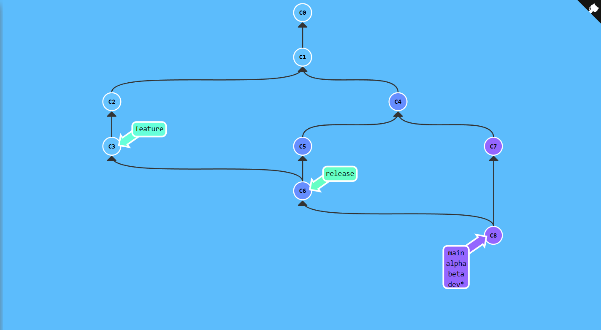
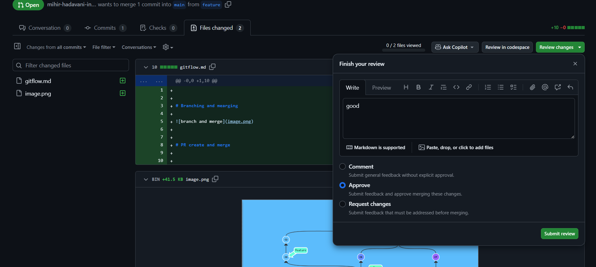
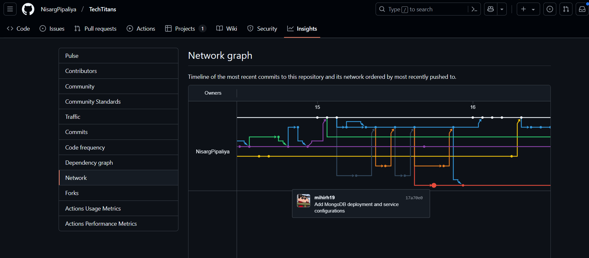

# Branching and mearging




```

$ git branch alpha

$ git branch dev

$ git branch feature

$ git checkout feature

$ git commit

$ git commit

$ git checkout main

$ git commit

$ git checkout -b release main

$ git commit

$ git merge feature

$ git checkout main

$ git commit

$ git merge release

$ git checkout alpha

$ git merge main

Fast forwarding...

$ git checkout dev

$ git merge main

```

# PR create and merge


## approve review and merge PR


After approve merge pull request

## One of my tech club repo flow 

